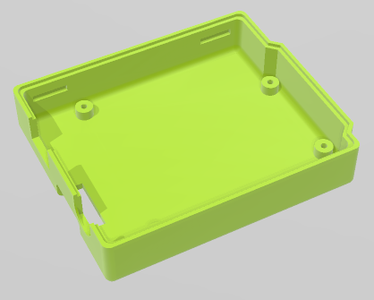

# ESP32-Steamakers-Box
Capsa per placa ESP32 Steamakers

   

Placa ESP32 Steamakers desenvolupada per [Innovadidàctic](https://shop.innovadidactic.com/ca/standard-placas-shields-y-kits/1567-placa-esp32-steamakers-no-incluye-cable-usb.html)  

Suports d'en [Jordi Mayné](https://github.com/maynej) des de Mechatronic Study jordi.mayne@mechatronicstudy.com 

La [documentació](https://docs.innovadidactic.com/_media/es/manuals/esp32/manual_actividades_esp32_steamakers.pdf) en PDF   

## Arxius per imprimir Suports per Micro:Steamakers

The supports helps to prevents short-circuits and take care of the components.
  
Descripció         | Imatge          | Arxiu STL    
------------- | ------------- | ------------- 
Base ESP32 Steamakers | | [Base](STL/BaseESPSteamakers.stl)
Base ESP32 Steamakers amb orelles | | [Base amb orelles](STL/BaseESPSteamakersOrelles.stl)
Tapa ESP32 Steamakers | | [Tapa](STL/TapaESPSteamakers.stl)
Tapa Reset ESP32 Steamakers | | [Tapa](STL/TapaESPSteamakersReset.stl)
Pin Reset | | [Tapa](STL/Pin_Reset.stl)

## Llicència
Creative Commons Attribution-NoComercial-ShareAlike 4.0 International (CC BY-NC-SA 4.0)  

## QR

